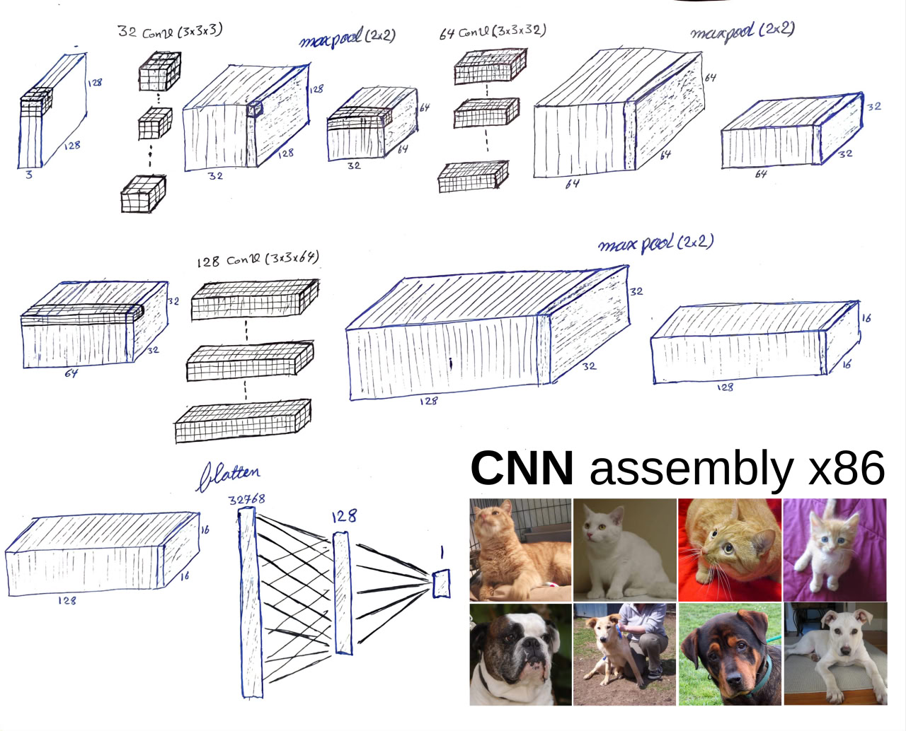
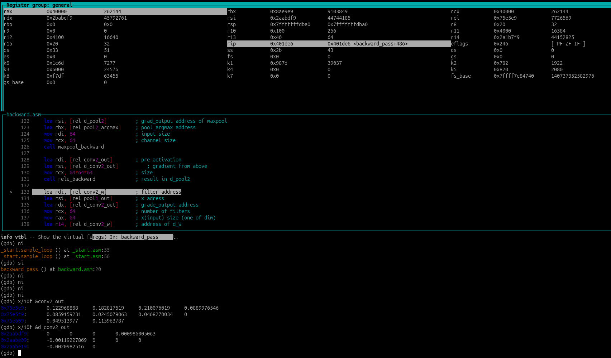

# Convolutional Neural Network in Assembly x86, From Scratch, ~10 times faster

Author: [Mohammad Ghaderi](https://www.linkedin.com/in/mohammad-ghaderi-ba09a8359)

#### Overview

This project implements a full Convolutional Neural Network (CNN) entirely in x86-64 **assembly language** for **cat–dog image classification**. The network is built completely from scratch, including convolution, pooling, dense layers, forward pass, and backward pass — with no machine learning frameworks or libraries.

The goal of this project was to deeply understand how CNNs work at the lowest possible level: memory layout, data movement, SIMD arithmetic, and training logic. Everything that is usually hidden behind high-level abstractions is explicitly implemented here in **pure assembly**.

The project runs inside a lightweight Debian Slim environment using Docker.

### Why I Built This

**Sometimes, we think we truly understand something, we try to build it from scratch** When **theory meets practice, every small detail becomes a challenge**.


After implementing a [fully connected neural network in assembly for MNIST](https://github.com/mohammad-ghaderi/mnist-asm-nn), I wanted to go further and tackle a real CNN for **cat-vs-dog classification**. Convolutions, pooling, tensor reshaping, and backpropagation introduce a completely different level of complexity when there are no libraries to rely on.




This project pushed me to understand CNNs not just mathematically, but mechanically: how every multiply, add, load, store, and branch maps directly to CPU instructions.

##### Performance & Optimization

Not only is this a pure assembly implementation, it is also heavily optimized:

    • AVX-512 SIMD acceleration using ZMM registers
      – 16 float32 values computed in parallel
      – Used in convolution, dense layers, and ...

    • End-to-end vectorized forward and backward passes

    • Approximately 10× faster than an equivalent NumPy implementation
      (NumPy itself relies on optimized C libraries)

Implementation Highlights

    • Convolution (Conv2D)
    • Max Pooling
    • Fully Connected (Dense) layers
    • Activation functions (ReLU, Sigmoid)
    • Forward propagation
    • Backward propagation (gradients & updates)
    • Data loader
    • Hyperparameter-driven and scalable design

### Dataset

+ Cat vs Dog classification
+ 25,000 RGB images (128 × 128 × 3)
+ Balanced dataset (cats and dogs)

### CNN Architecture

| Layer   | Type                        | Input → Output         |
| ------- | --------------------------- | ---------------------- |
| Conv1   | #32 Conv2D (3×3) + ReLU     | 3×128×128 → 32×128×128 |
| Pool1   | MaxPool (2×2)               | 32×128×128 → 32×64×64  |
| Conv2   | #64 Conv2D (3×3) + ReLU     | 32×64×64 → 64×64×64    |
| Pool2   | MaxPool (2×2)               | 64×64×64 → 64×32×32    |
| Conv3   | #128 Conv2D (3×3) + ReLU  | 64×32×32 → 128×32×32   |
| Pool3   | MaxPool (2×2)               | 128×32×32 → 128×16×16  |
| FC1     | Dense + ReLU                | 32768(128×16×16) → 128 |
| FC2     | Dense + Sigmoid             | 128 → 1                |
+ Epochs: 10
+ Batch size: 16
+ Learning rate: 0.01

The code is written in a way that allows changing some of hyperparameters without rewriting the rest of the implementation.

###### Debugging Challenges

Debugging a CNN written in pure assembly is extremely challenging. Traditional tools like GDB become difficult to use when dealing with large tensors, SIMD registers, and deeply nested computations.

Because of this, I developed my own debugging techniques, including manual tensor validation, controlled test inputs, and custom inspection routines to verify correctness at each stage of the network.

###### Environment

    • Architecture: x86-64
    • SIMD: AVX-512
    • OS: Debian Slim
    • Runtime: Docker
    • Assembler: NASM

####  Previous Work
Neural Network in Assembly (MNIST from Scratch)
https://github.com/mohammad-ghaderi/mnist-asm-nn


#### Debuggin environment



## Build & Run with Docker
This project can be built and run inside a Docker container with NASM and build tools installed. Follow these steps:


#### Build the Docker image
```bash
docker build -t nasm-assembly .
```

### Run the Docker Container
```
docker run \
  --volume="PATH/TO/PROJECT:/mnt/project" \
  --cpus=4 \
  --memory=4g \
  --memory-swap=4g \
  nasm-assembly
```
Replace `PATH/TO/PROJECT` with your local project folder, e.g.:

- Windows: `C:/Users/YourName/cat-dog-asm-cnn`  
- Linux/Mac: `/home/username/cat-dog-asm-cnn`

#### Enter the Container
```
docker exec -it <container_id_or_name> bash
```

#### Run & build 
This project includes a `build.sh` script to assemble, link, and run the NASM neural network.

```
./build.sh
```
- This will assemble all .asm files, link them, and produce the executable ./model.

Run the neural network model:
```
./model
```

#### Downloading Dataset and Initial parameters
